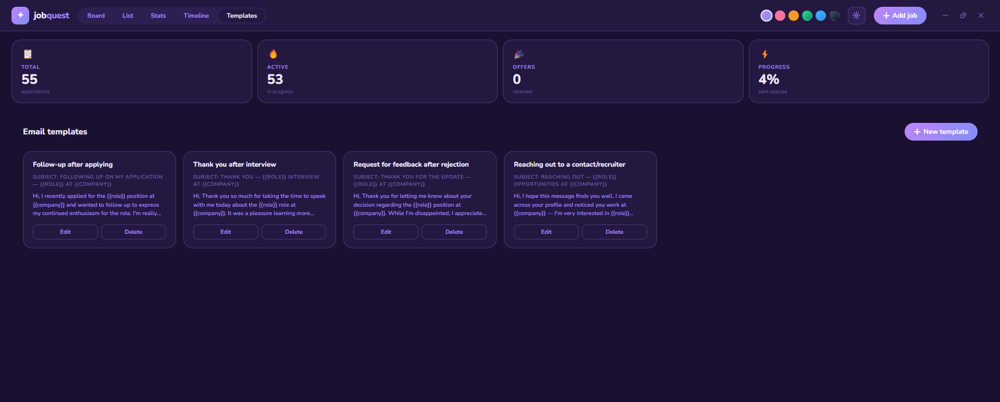

# JobQuest

A desktop job application tracker built with Electron. I made this because spreadsheets felt too clinical and I wanted something that was actually nice to look at while job hunting.



---

## What it does

**Views**
- **Kanban board** — drag cards between columns as your application progresses (Applied → Phone Screen → Interviewing → Offer, or the less fun ones)
- **List view** — sortable table if you prefer rows over cards. Sort by date, company name, salary, or work type. Toggle "Hide inactive" to remove Rejected and Ghosted entries from view
- **Stats** — a quick breakdown of where everything stands: status distribution, work type mix, and a response funnel
- **Timeline** — a chronological feed and a monthly calendar of all your application activity. Status changes are logged automatically going forward
- **Templates** — a library of reusable email templates for follow-ups, thank yous, feedback requests, and recruiter outreach

**Per-application storage**

Each job card stores a lot more than just the basics:
- Cover letter
- Resume (uploaded as a file, stored locally)
- Emails — pick from your template library, auto-filled with the company name, role, and your name, then edit before sending
- Bonus Q&A — save answers to those long application form questions so you can reuse them
- Notes — interview prep, contacts, follow-up reminders

**Search & filter**

A search bar sits above the stat cards and searches by company name and role as you type. Click into it to expand filter pills for status, work type, and salary range. Filters apply across both the board and list views, and the CSV export only exports what's currently visible.

**Other bits**
- Six dark themes — purple, pink, peach, mint, ocean, and midnight. Picked from swatches in the top bar, remembered between sessions
- Custom title bar — no OS chrome, just the app. Window controls (minimise, maximise, close) are built in and match your theme
- Export to CSV from the gear menu
- Scrollbars that match your current theme
- Confetti when you log a new "Applied" application
- Window size and position remembered between sessions
- First-launch name prompt so email templates can auto-fill `{{your_name}}`

---

## Getting started

You'll need [Node.js](https://nodejs.org) installed (the LTS version is fine).

```bash
git clone https://github.com/yourusername/jobquest.git
cd jobquest
npm install
npm start
```

`npm install` pulls down Electron (~100 MB, one time only) and `npm start` opens the app.

The first time you open it, you'll be asked for your name — this is used to auto-fill the `{{your_name}}` placeholder in email templates. You can change it any time from the gear menu.

---

## Your data

Everything is stored locally — nothing leaves your machine.

- **Windows:** `%APPDATA%\jobquest`
- **macOS:** `~/Library/Application Support/jobquest`
- **Linux:** `~/.config/jobquest`

Resumes are stored as base64 inside the same JSON blob as everything else, so there's no separate folder to worry about. The localStorage keys are `jobquest_jobs`, `jobquest_templates`, `jobquest_theme`, and `jobquest_user_name` if you ever want to back things up manually.

**Updating the app** — if only `index.html` changed, just replace that. If `main.js` or `preload.js` also changed, replace those too. Run `npm install` again only if `package.json` changed.

---

## Project structure

```
jobquest/
├── index.html    # the entire app UI and logic
├── main.js       # Electron main process — window creation, IPC handlers
├── preload.js    # secure bridge between renderer and Electron APIs
└── package.json
```

---

## Building a distributable

If you want a proper installable `.exe` or `.dmg` instead of running from source:

```bash
npm run build:win    # Windows installer
npm run build:mac    # macOS .dmg
npm run build:linux  # Linux AppImage
```

Output lands in the `dist/` folder. You'll need to be on the target platform to build for it (or use a CI runner).

---

## Stack

- **Electron** for the desktop wrapper
- **Vanilla JS** — no framework, no bundler. The whole app is a single `index.html`
- **Nunito** (Google Fonts) for the rounded, friendly type
- **HTML5 Drag and Drop API** for the kanban drag and drop
- **Canvas API** for confetti

---

## Contributing

Issues and PRs welcome. The codebase is intentionally simple — one HTML file, one `main.js`, one `preload.js` — so it should be easy to navigate. If you're adding a feature, try to keep it in that spirit.

---

## License

MIT
